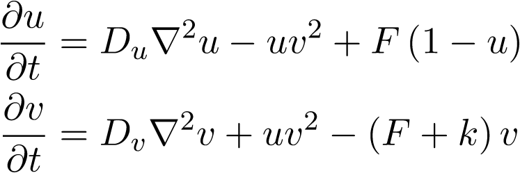

# 3D Gray-Scott solver
3D Gray-Scott reaction-diffusion model solver utilizing the `CubismNova` 
framework. Solver serves as an application and testing ground for the created
naive and optimized Laplacian compute kernels.   

## Gray-Scott model background 

### Introduction

The Gray-Scott model is composed of two coupled parabolic PDEs. The PDEs 
represent the transport of two chemical species, along with reaction- and 
system-dependent source and sink terms. The equations are coupled through 
the reaction term which arises due to the "law of mass attraction" from 
reaction kinetics. 

The rightmost term in the top equation is called the "replenishment term", 
which essentially acts as a source term. The source term is driven by the 
feed-rate `F`. The following provides a more physical interpretation for the 
source term

* semi-permeable membrane surrounds the computational domain; 
* the species `U` is replenished through the membrane from an outside source; 
* specifically, the replenishment occurs by diffusion through the membrane;
* the feed-rate `F` can be thought off as the membrane's permeability; 
* e.g. in biological applicaitons, `U` denotes a bloodflow supplied chemical. 

The rightmost term of the bottom equation is called the "diminishment term", 
which essentially acts as a sink term. It represents the diffusion of species 
`V` out of the system. This is not specifically a physical process, but rather 
a chemical reaction in which the `V` species become inert. 

### Applications 

Aside from generating beautiful patterns, the Gray-Scott model has found 
applications in the fields of pattern formation and developmental biology. 
These fields were propelled by the seminal works of A. M. Turing in 
"The Chemical Basis of Morphogenesis" and H. Meinhardt in "Models of 
Biological Pattern Formation: From Elementary Steps to the Organization of 
Embryonic Axes". 

Their work expanded on F. Crick's hypothesis that chemical gradients, 
generated purely through Brownian motion, dictate which organ a group of cells 
in the embryo should become. However, pure diffusion yields only linear 
concentration gradients. It was later discovered that diffusion-reaction 
systems were required to obtain the exponential decay chemical gradient that 
was observed within the embryo. 

An entire zoo of reaction-diffusion models exist, however, not all of them 
carry the same biological significance. Oscillations are central to biological 
phenomena, such as the Circadian rhythm or predator-prey models. However, many 
mathematical models exhibit bifurcations, which are clearly not physical. For 
example, flying halfway across the globe will perturb your interior clock, 
however, the oscillation characterizing your Circadian rhythm remains constant. 
Therefore, a mathematical model with biological significance must exhibit 
oscillations which are stable to a certain degree of system perturbations. 
This system behavior was discovered by H. Poincaré and termed a limit cycle.  

The Gray-Scott reaction-diffusion model exhibits limit cycle behavior. The 
extent to which it can represent real biological systems is yet unknown, 
however, the model has found many applications in biological pattern formation

* the labyrinth roll pattern found on giant pufferfish; 
* stripes on zebra, tigers, and many more; 
* spots on several animals such as giraffes.   

Most interestingly perhaps, the Gray-Scott model provides an elegant
demonstration of the patterns on a cat's tail slowly transitioning from spotted
patterns to stripped patterns as the tail becomes narrower from the base to 
the tip. This phenomenon can be easily replicated by altering the width of the 
computational domain for the Gray-Scott model. 

  
  

## Running the code 

## Sample results 
